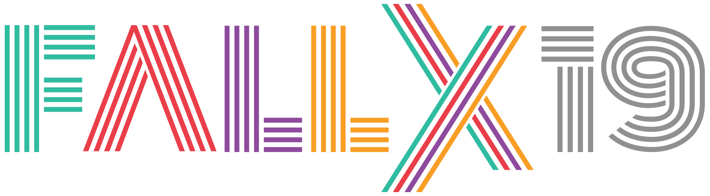
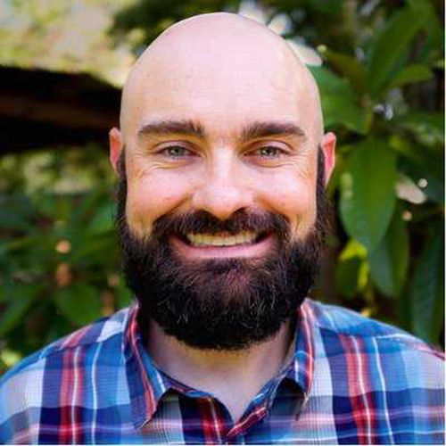

# @css[shadow](@color[#ECD290](Cream) @color[#F15322](City) @color[#688B8B](Code))

---

## @css[shadow](@css[ccc-cream](Code) @css[ccc-orange](of) @css[ccc-blue](Conduct))

@css[shadow span-100](@size[.75em](Our festival is dedicated to providing a harassment-free festival experience for everyone, regardless of gender, gender identity and expression, age, sexual orientation, disability, physical appearance, body size, race, ethnicity, religion (or lackthereof&#41;, or technology choices. We do not tolerate harassment of festival participants in any form. Sexual language and imagery is not appropriate for any festival venue, including talks, workshops, parties, Twitter and other online media. Festival participants violating these rules may be sanctioned or expelled from the festival without a refund at the discretion of the festival organizers.))

---

---

# @css[shadow](@css[ccc-cream](Social) @css[ccc-blue](Media))
 @size[1.8em](@css[twitter](@fa[twitter] @creamcitycode))
  
 @size[1.8em](@css[twitter](#creamcitycode))
 

 @size[1.8em](@css[twitter](@fa[twitter] @fallexperiment))
  
 @size[1.8em](@css[twitter](#fallexperiment))
---

# @css[shadow](@css[ccc-cream](Restrooms))

# @size[2em](@css[ccc-orange](@fa[toilet]) + @css[ccc-blue](@fa[toilet-paper]))

---?image=assets/map.jpg&size=contain&opacity=100

@snap[north span-100]
 
# @css[sharp-shadow](@css[ccc-cream](Breakout) @css[ccc-blue](Sessions))
@snapend

---

# @css[shadow](@css[ccc-cream](Food))

# @size[2em](@css[ccc-orange](@fa[utensils]) + @css[ccc-blue](@fa[hamburger]))

---

# @css[shadow](@css[ccc-cream](Thank) @css[ccc-blue](You!))
 - Sponsors
 - Attendees
 - Speakers
 - Organizers
 - @css[twitter](#DeveloperCommunity)

---

# @css[shadow](@css[ccc-cream](Nickolas) @css[ccc-blue](Means))

@css[shadow](@size[1.8em](@css[twitter](@fa[twitter] @nmeans)))

Note:

