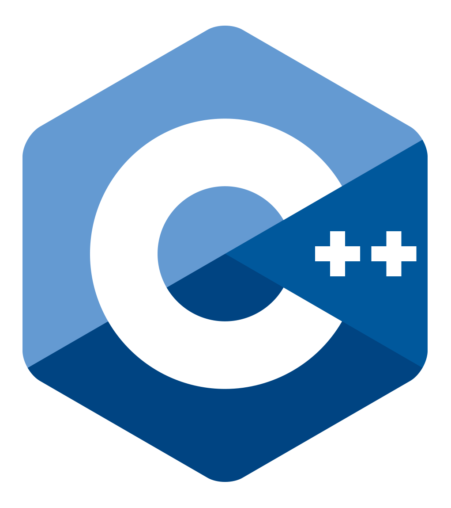
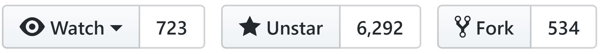

---

@size[2.7em](@css[wasm](WebAssembly))
### The New Endgame?

<br />
[@davidpine7 @css[twitter](@fa[twitter])](https://twitter.com/davidpine7) | [davidpine.net @color[red](@fa[globe])](http://davidpine.net/)

---?image=assets/that-conference-branding.png&size=contain
---?image=assets/that-conference-sponsors.png&size=contain
---

# I @color[red](@fa[heart]) The
### @css[twitter](#DeveloperCommunity @fa[twitter])

---

# @css[wasm](Wat?!)

---

> @fa[quote-left] @css[wasm](WebAssembly) is a binary instruction format for a stack-based virtual machine.
>
> @fa[hand-o-right] <cite>https://webassembly.org/</cite>

---?image=assets/wtf.webp&size=auto 90%
---

# @color[cyan](`.TryParse`) @css[that](THAT)

---

> @fa[quote-left] @css[wasm](WebAssembly) is a @css[emphasize](binary instruction format) ...
>
> @fa[hand-o-right] <cite>https://webassembly.org/</cite>

---?image=assets/ast.png&size=contain
---

> @fa[quote-left] @css[wasm](WebAssembly) ... format for a @css[emphasize](stack-based virtual machine).
>
> @fa[hand-o-right] <cite>https://webassembly.org/</cite>

---

@transition[none]
@snap[west]
@size[3em](@css[red bold sharp-glow](Push @fa[hand-o-down]))
@snapend

@snap[east]
@size[3em](@css[green bold sharp-glow](Pop @fa[arrow-up]))
@snapend

---

### Today, @color[grey](binary execution<br/>format) for the @color[magenta](WEB)
<br/>
### It's @color[grey](future) is looking at <br/>@color[orange](MOBILE) and @color[skyblue](IoT)!

---

> @fa[quote-left] @css[wasm](Wasm) is designed as a @css[underline,red](portable target) for compilation of high-level languages like




> <br/> @fa[hand-o-right] <cite>https://webassembly.org/</cite>

---

# Example
@ul[none]
 - @size[2.2em](@css[bold]( <span id="code"></span> ) &nbsp; @color[darkgreen](@fa[plus-circle]))
 - @size[2.2em](@color[grey](@fa[cogs]) compile  &nbsp; @color[darkgreen](@fa[arrow-circle-right]))
 - @size[2.2em](@css[wasm](`*.wasm`) @color[darkgreen](@fa[check-circle]))
@ulend

---?image=assets/fk.png&size=contain

@transition[none]
@snap[south]

[@css[demo](Demo @fa[external-link-square])](https://www.funkykarts.rocks/demo.html)

@snapend
---?image=assets/magic.webp&size=auto 90%
---

## [ has it... but,](https://www.chromestatus.com/feature/5453022515691520)
<br/>
## [@color[#39b54a]("can I use") it?](https://caniuse.com/#search=webassembly)

---

### @css[wasm](WebAssembly) Support!

<div class="grid">
    <div class="top-left">
        
    </div>
    <div class="top-right">
        
    </div>
    <div class="bottom-left">
        
    </div>
    <div class="bottom-right">
        
    </div>
</div>

---

## World Wide Web @color[lightblue](Consortium)


---

## Text Format (@css[wasm](`.wat`))
#### @color[orange](Human Readable)

```
(module
  (func $i (import "imports" "imported_func") (param i32))
  (func (export "exported_func")
    i32.const 42
    call $i
  )
)
```

---

# What it<br/>@color[red](is not!)

---

> @fa[quote-left] @css[wasm](WebAssembly) is @css[red bold shadow](not) `x86` or some other specific machine code instruction set.

---?image=assets/cpu-pic.png&size=contain

@transition[none]
@snap[north]

<h4 class="one-half">@color[black](@css[red bold](NOT) directly on CPU)</h4>

@snapend

Note:
Web Assembly actually is a specification for a byte code format. It's a format for machine instructions that's quite a low-level format, hence the name web assembly. It's not regular assembly, it's not x86 machine code or any of the specific instruction set that runs directly on the CPU but rather is a small instruction set. Similar to the java virtual machine or the microsoft intermediate language for .NET. It's a high-level low-level language if that makes sense?

---

> @fa[quote-left] @css[wasm](WebAssembly) is @css[red bold shadow](not) a third-party plugin. Plugins expose severe security risks!

---?image=assets/sandbox.png&size=auto 90%

@transition[none]

@snap[north]

<h4 class="one-half">@color[black](Same @color[magenta]("security sandbox")<br/>as @css[js](JavaScript))
</h4>

@snapend

---

> @fa[quote-left] @css[wasm](WebAssembly) is @css[red bold shadow](not) versioned @fa[code]. Instead it is versionless, feature-tested, and backwards-compatible.

---

> @fa[quote-left] @css[wasm](WebAssembly) is @css[red bold shadow](not) a @css[js](JavaScript) replacement!

---?image=assets/wasm-js.png&size=contain
---

> @fa[quote-left] @css[wasm](WebAssembly) is @css[red bold shadow](not) a programming language!

---?image=assets/target.webp&size=auto 90%

# @css[shadow](Compilation) @css[target](Target @fa[dot-circle-o])

---

> @fa[quote-left] @css[wasm](WebAssembly) is @css[red bold shadow](not) the ideal tool @fa[wrench] for every web project!

---

# @css[js](JavaScript)
### @color[magenta](HTTP GET Request)

---

```javascript
fetch("http://api.icndb.com/jokes/random?limitTo=[nerdy]")
    .then(r => r.json())
    .then(json => console.log(json.value.joke));

// Chuck Norris is the ultimate mutex, all threads fear him.
```

Note:
const x = () => fetch("http://api.icndb.com/jokes/random?limitTo=[nerdy]")
    .then(r => r.json())
    .then(json => console.log(json.value.joke));

---

# @css[c](C Lang)
### @color[magenta](HTTP GET Request)

---?code=source/hello.c&lang=c

@[1-7](LOL: Headers @css[shaking](@fa[meh-o]))
@[9](Ugh: `main` @css[shaking](@fa[meh-o]))
@[11-17](Declarations & Memory Sets @css[shaking](@fa[meh-o]))
@[18-22](Open Socket @css[shaking](@fa[meh-o]))
@[24-25](Connect to Socket @css[shaking](@fa[meh-o]))
@[27-29](Send Request @css[shaking](@fa[meh-o]))
@[31-34](Receive Response @css[shaking](@fa[meh-o]))

---

## Emscripten

> Emscripten is a toolchain for compiling to @css[wasm](WebAssembly), built using <strong>LLVM</strong>, that lets you run @css[c shadow](C) and @css[c shadow](C++) on the web at near-native speed without plugins.

---

@css[demo](Demo @fa[check-square])

Note:
IEvangelist.Emscripten project. Locally compiling C++ targeting .wasm. Outputs .html / .js and .wasm!

---

## [@css[wasm](WASM) Explorer @color[red](@fa[external-link-square])](https://mbebenita.github.io/WasmExplorer/)
<br/>
## [@css[wasm](WASM) Fiddle @color[red](@fa[external-link-square])](https://wasdk.github.io/WasmFiddle/?haxse)

---

# @css[wasm](Why?!)

---?image=assets/use-cases.png&size=contain
---

### @color[#fbba29](HANSEL)@color[#c97229](MINUTES) Podcast

@css[flash](@color[whitesmoke](&nbsp; @fa[ellipsis-h] &nbsp; @fa[microphone] &nbsp; @fa[ellipsis-h] &nbsp;))

##### @css[scott](Scott Hanselman) @css[steve](Steve Sanderson)

### <a href="https://hanselminutes.com/642/blazor-brings-net-to-web-assembly-with-steve-sanderson" target="_blank">@fa[external-link]</a>

---

> Web development has been constrained because everything has to be done in @css[js](JavaScript).<br/><br/>Web development as a discipline will be able to grow up and mature a little.

---

### @color[orange](My) Interview With @css[steve](Steve Sanderson)

---

> I hope that the future of web development includes giving developers a wider choice of languages and platforms.<br/><br/>There's nothing wrong with @css[js](JavaScript), but our industry would be healthier if multiple paradigms and specializations were better catered for.

---

# @css[wasm](How?!)

---

## @color[grey](Mono Runtime)


---

### The @color[grey](Mono Runtime) implements the @css[ecma](ECMA) Common Language Infrastructure

---

# @css[bz](Blazor)

@ul[none]
- @size[2.2em](@color[cyan](Browser))
- @size[2.2em](@color[grey](+) @color[lime](Razor))
- @size[2.2em](@color[grey](=) @css[bz](Blazor!))
@ulend

---?image=assets/blazor.png&size=contain
---

## As of @color[grey](August 8<sup>th</sup>)
#### https://github.com/aspnet/Blazor


---?image=assets/cuzCSharp.png&size=contain

@snap[west]
@size[2.5em](@css[wasm](wasm))
@snapend

@snap[east]
@size[2.5em](@css[red bold](spasm!))
@snapend

---

## @color[yellow](@fa[exclamation-triangle]) Disclaimer @color[red](@fa[ban])

> @fa[quote-left] @css[bz](Blazor) is an experiment! It is @css[red bold](not) yet a committed product.

---?image=assets/interpreted-mode.png&size=contain
---?image=assets/aot-mode.png&size=contain
---

@css[demo](Demo @fa[check-square])

---

# Resources

### https://blazor.net/
<br/>
### https://learn-blazor.com/


---?image=assets/that-conference.png&size=contain
---

## Thank you

<br/>
[@davidpine7 @css[twitter](@fa[twitter])](https://twitter.com/davidpine7) | [davidpine.net @color[red](@fa[globe])](http://davidpine.net/)